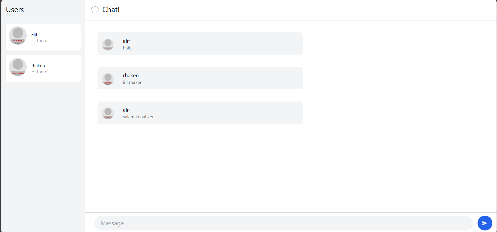

__3.1. Original code__

Pada tutorial ini saya melakukan clone dari github SimpleWebSocket sebaga integrasi websocket dan YewChat sebagai frontend dari chat nya. Lalu tertampilah kata kata dari client client yang ada.

__3.2 . Add some creativities to the webclient__

Saya menambahkan beberapa warna pada website yew sehingga tidak hanya putih polos saja.

